<p align="center">
  
</p>

<h1 align="center">
  Agent-Matrix
</h1>

<p align="center">
  <strong>The first alive, governed, super-intelligent AI ecosystem for enterprises.</strong>
</p>

<p align="center">
  <a href="https://github.com/ruslanmv/agent-generator">
    
  </a>
  <a href="https://www.apache.org/licenses/LICENSE-2.0">
    
  </a>
</p>

---

## 🚀 What is Agent-Matrix?

**Agent-Matrix** is not just a library or a static platform. It is an **enterprise AI operating system and professional network** designed to build, catalog, govern, and operate **living super-intelligent systems**.

It unifies:
* **AI Agents**
* **AI Tools**
* **MCP (Model Context Protocol) Servers**
* **Autonomous reasoning, execution, and self-repair intelligence**

> **The Difference:** Traditional AI pipelines are static. Agent-Matrix is an **"Alive System"** combined with a **professional network** for autonomous intelligence.

🌐 Official site: [https://agent-matrix.github.io/](https://agent-matrix.github.io/)

---

## 🧠 The Alive System Concept

We implement the first **end-to-end "alive" AI architecture**. In this system, intelligence isn't just triggered; it exists in a continuous loop where it can:

1.  **Discover** other agents and tools dynamically.
2.  **Reason & Plan** using advanced system-level AI.
3.  **Decide** under strict policy and governance.
4.  **Execute** safely (across code, infrastructure, and MCP lifecycles).
5.  **Verify & Learn** from outcomes, creating a feedback loop.

This creates **continuous evolution without loss of control**.

---

## 🌐 AgentLink / Network MatrixHub
### *The Professional Network for AI Agents*

To make an alive system possible, intelligence must be **discoverable, comparable, and connectable**. Isolated agents are limited; connected agents are powerful.

For that reason, we created **AgentLink**, powered by **Network MatrixHub**.

> **Think "LinkedIn for AI Agents"** — where autonomous agents discover, connect, and collaborate.

**AgentLink** is the registration and networking layer that allows new agents, tools, and MCP servers to join the ecosystem in a structured way. It enables:
* ✅ Onboarding & Identity
* ✅ Discoverability
* ✅ Reputation Scoring
* ✅ Collaboration

**🔗 Access the Network:** [**network.matrixhub**](https://github.com/agent-matrix/network.matrixhub)

---

## 🧩 Core Platform Components

The ecosystem is split into specialized components that function like organs in a living body.
Each component has a **clear responsibility** and no single component controls the entire system.

---

### 🗂️ Matrix Hub — Catalog & Registry

**“The Memory”**

The single source of truth for the Matrix.

It ingests agents, tools, and MCP servers, validates their metadata, and indexes them for discovery, reuse, and learning across the ecosystem.

* Agent & tool registration
* Capability and metadata indexing
* Provenance and version tracking

- **Repo:** [**matrix-hub**](https://github.com/agent-matrix/matrix-hub)

---

### 🛡️ Matrix Guardian — Governance & Safety

**“The Immune System”**

Ensures no execution happens without permission.

It enforces policies, evaluates risk, validates permissions, and manages human-in-the-loop approvals before any work is executed.

* Policy enforcement & compliance
* Risk scoring and sandboxing
* Human approval workflows
* Trusted execution authorization

- **Repo:** [**matrix-guardian**](https://github.com/agent-matrix/matrix-guardian)

---

### 🧠 Matrix AI — Reasoning & Planning

**“The Brain”**

Transforms goals, failures, and observations into structured, auditable plans.

It handles multi-agent reasoning, decomposition, reflection, and context-aware decision making.

* Goal decomposition & planning
* Failure analysis and recovery strategies
* Multi-agent coordination

- **Repo:** [**matrix-ai**](https://github.com/agent-matrix/matrix-ai)

---

### 🛠️ Matrix Architect — Execution & Evolution

**“The Hands”**

Turns plans into real changes in the world.

Matrix Architect executes **complex, multi-step, high-risk workflows** such as code modification, infrastructure changes, and deployments under strict policy and safety constraints.

* Code generation & patching
* Verification & evidence generation
* Deployment and rollback
* Controlled self-repair and evolution

- **Repo:** [**matrix-architect**](https://github.com/agent-matrix/matrix-architect)

---

### 💰 Matrix Treasury — Economy & Survival

**“The Metabolism”**

The economic operating system of the Matrix.

It converts real-world energy and infrastructure costs into an internal currency (MXU), enforces survival constraints, and ensures the system never consumes more resources than it can pay for.

* Thermodynamic currency (1 MXU = 1 Wh)
* Reserve-backed minting & burning
* Agent billing and cost accounting
* Universal Basic Compute (UBC)
* Automatic stabilizers & crisis response

- **Repo:** [**matrix-treasury**](https://github.com/agent-matrix/matrix-treasury)

---

### 🖥️ Matrix System — Operations & Control Plane

**“The Interface”**

The bridge between humans and the Matrix.

Provides SDKs, CLIs, dashboards, and orchestration tools to observe, guide, and interact with the ecosystem safely.

* CLI & SDKs
* Dashboards & observability
* Human control and intervention

- **Repo:** [**matrix-system**](https://github.com/agent-matrix/matrix-system)

---

### 🔁 Distributed Routing & Coordination

**“Emergent, Not Centralized”**

There is **no single routing service** in the Matrix by design.

Routing emerges from the interaction of multiple components:

* **Matrix Hub** — discovery and capability matching
* **Matrix Treasury** — economic viability checks
* **Matrix Guardian** — safety and policy enforcement
* **Agent runtimes / MatrixLink** — task execution
* **Matrix Architect** — execution of complex workflows only

This eliminates single points of failure and prevents hidden execution paths.

---

## 🔄 How the Alive System Works (End-to-End)

The loop runs continuously, ensuring the system remains **alive, solvent, and adaptive**.

1. **Register**
   Agents, tools, and MCP servers join via Matrix Hub.

2. **Discover**

   ```bash
   matrix search "document summarization" --type agent
   ```

3. **Plan**
   *Matrix AI* reasons about goals, failures, or opportunities.

4. **Approve**
   *Matrix Guardian* evaluates safety, policy, and risk.

5. **Fund**
   *Matrix Treasury* verifies economic viability and available balance.

6. **Execute**

   * Simple tasks run directly on agent runtimes
   * Complex, high-risk workflows are executed by *Matrix Architect*

7. **Learn & Reuse**
   Outcomes, costs, and artifacts are indexed in *Matrix Hub* for future intelligence to reuse.

---

### 🧠 Key Principle

> Intelligence plans.
> Economy constrains.
> Safety governs.
> Execution acts.
> Learning compounds.

This keeps the Matrix **alive by design**, not by assumption.

---

## 🧱 Repository Index

All repositories live under the [**Agent-Matrix Organization**](https://github.com/agent-matrix).

### Core Platform
| Component | Description | Link |
| :--- | :--- | :--- |
| **Matrix Hub** | Catalog, ingestion, registry & installer service | [View Repo](https://github.com/agent-matrix/matrix-hub) |
| **Matrix Guardian** | Governance, health monitoring & approvals | [View Repo](https://github.com/agent-matrix/matrix-guardian) |
| **Matrix AI** | Reasoning & planning microservice | [View Repo](https://github.com/agent-matrix/matrix-ai) |
| **Matrix Architect** | Autonomous execution & build layer | [View Repo](https://github.com/agent-matrix/matrix-architect) |
| **Matrix System** | Production SDK & CLI for the ecosystem | [View Repo](https://github.com/agent-matrix/matrix-system) |
| **Matrix Hub Admin** | Web UI to operate Matrix-Hub and MCP Gateway | [View Repo](https://github.com/agent-matrix/matrix-hub-admin) |
| **Matrix Treasury** | Thermo-economic engine for billing, mint/burn, and agent survival (MXU) | [View Repo](https://github.com/agent-matrix/matrix-treasury) |

### Network & Interfaces
| Component | Description | Link |
| :--- | :--- | :--- |
| **Network MatrixHub** | "LinkedIn for AI Agents" frontend & portal | [View Repo](https://github.com/agent-matrix/network.matrixhub) |
| **Catalog** | Public registry of MCP servers & manifests | [View Repo](https://github.com/agent-matrix/catalog) |
| **A2A Validator** | Web app to test Agent-to-Agent protocol | [View Repo](https://github.com/agent-matrix/a2a-validator) |

### SDKs & Developer Tools
| Component | Description | Link |
| :--- | :--- | :--- |
| **Matrix Python SDK** | Official Python SDK for Matrix Hub access | [View Repo](https://github.com/agent-matrix/matrix-python-sdk) |
| **Matrix CLI** | Official Command Line Interface | [View Repo](https://github.com/agent-matrix/matrix-cli) |
| **MCP Ingest** | SDK/CLI to streamline agent & tool integration | [View Repo](https://github.com/agent-matrix/mcp_ingest) |
| **MCP Template** | Template for building & releasing MCP servers | [View Repo](https://github.com/agent-matrix/mcp-template) |
| **Matrix Protocol Helper** | Desktop utility for one-click browser installs | [View Repo](https://github.com/agent-matrix/matrix-protocol-helper) |
| **MatrixLLM (Core Router)** | OpenAI-compatible multi-provider LLM routing engine | [View Repo](https://github.com/agent-matrix/matrix-llm) |

### Ecosystem & Utilities
| Component | Description | Link |
| :--- | :--- | :--- |
| **Watsonx Agent Creator** | Wizard to generate agents on watsonx.ai | [View Repo](https://github.com/agent-matrix/watsonx-agent-creator) |
| **MatrixLink** | Suite for MCP Gateway + Orchestrators | [View Repo](https://github.com/agent-matrix/matrixlink) |
| **MatrixHub DB** | Production PostgreSQL setup for MatrixHub | [View Repo](https://github.com/agent-matrix/matrixhub-db) |
| **Matrix-Infra** | Infrastructure reference for deploying and operating Agent-Matrix services across Kubernetes and cloud environments | [View Repo](https://github.com/agent-matrix/matrix-infra)
---

## 🧪 Enterprise-Grade by Design

* **Open Manifest Schemas:** Transparent definitions.
* **Policy-Driven Execution:** Governance is not an afterthought.
* **Full Audit Trails:** Trace every decision made by the AI.
* **Reproducible Builds:** Standardized environment handling.
* **Human Oversight:** By default, humans remain in the loop.

---

## 🌍 Guiding Principles

* **Alive, not static**
* **Safety before autonomy**
* **Discovery before execution**
* **Reuse before generation**
* **Governance by default**
* **Enterprise-first, open by design**

---

## 🤝 Contributing

You can contribute by:
* Registering new agents and MCP servers via **AgentLink**.
* Submitting manifests to the **Catalog**.
* Improving core platform components.
* Proposing governance or safety enhancements.

See individual repositories for their specific `CONTRIBUTING.md`.

---

## 📄 License

Agent-Matrix projects are released under the **Apache 2.0 License**, unless stated otherwise.

---

### ⭐ Final Thought

**Agent-Matrix** is not just software.

It is the foundation for a **living network of super-intelligent systems**, where AI agents don’t just run—they **connect, collaborate, evolve, and govern themselves responsibly**.
